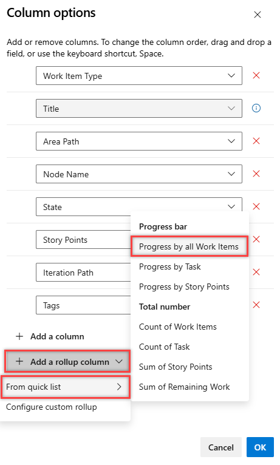

# Display rollup progress or totals in Azure Boards

[!INCLUDE [version-lt-eq-azure-devops](../../includes/version-lt-eq-azure-devops.md)]

Rollup automatically sums child work item values to display totals on parent items. Use it to track work estimates, effort, size, or story points across your backlog hierarchy. Learn how to add rollup columns to backlogs, sprint planning, and taskboards.

[!INCLUDE [ai-assistance-mcp-server-tip](../../includes/ai-assistance-mcp-server-tip.md)]

> [!IMPORTANT]
> - Rollup supports progress bars, work item counts, and numeric field sums for descendant work items within the same project.
> - Rollup requires parent-child links in the backlog hierarchy; test case links aren't included in rollup calculations.
> - In Delivery Plans, child items from other projects aren't included in rollup calculations.
> - Support for specific numeric fields, such as Effort, Story Points, or Size, depends on the selected backlog level and process configuration.

In the following example, **Progress by Work Items** shows progress bars based on the percentage of closed descendant items. For Epics, this includes all child Features and their descendants. For Features, this includes all child User Stories and their descendants.

> [!div class="mx-imgBorder"]
> 

::: moniker range="azure-devops"

> [!NOTE]
> Rollup progress is available in Delivery Plans. For more information, see [Review team Delivery Plans](../plans/review-team-plans.md).

::: moniker-end

## Prerequisites

::: moniker range="azure-devops"

| Category | Requirements |
|--------------|-------------|
| Required access | You can open the target backlog or Delivery Plan, edit column options for your view, and have [**Basic** or **Stakeholder** access](../../organizations/security/access-levels.md), based on your project configuration. |
| Hierarchy readiness | Parent and child work items are linked with parent-child relationships. |
| Field readiness | The numeric fields you want to roll up are present on child work item types. |

::: moniker-end

::: moniker range="< azure-devops"

| Category | Requirements |
|--------------|-------------|
| Analytics service | Analytics must be enabled on Azure DevOps Server. For more information, see [Install/uninstall or enable/disable the Analytics service](../../report/dashboards/analytics-extension.md). |
| Required access | You can open the target backlog and edit column options for your view. |
| Hierarchy readiness | Parent and child work items are linked with parent-child relationships. |
| Field readiness | The numeric fields you want to roll up are present on child work item types. |

::: moniker-end

## Rollup and hierarchical work items

Backlog hierarchy differs by process, but the rollup setup pattern is the same:

- Use parent-child links to build the hierarchy.
- Map items in the backlog or add items directly under a parent.
- Confirm the hierarchy before adding rollup columns.

For setup details, see [Organize your backlog, map child work items to parents](organize-backlog.md#map-items-to-group-them-under-a-feature-or-epic) and [Board features and epics](../boards/kanban-epics-features-stories.md).

#### [Agile process](#tab/agile-process)

In the Agile process, teams can manage bugs at the same level as User Stories or Tasks by adjusting the [Working with bugs](../../organizations/settings/show-bugs-on-backlog.md) setting.

> [!div class="mx-tdCol2BreakAll"]
> 

#### [Basic process](#tab/basic-process)

The Basic process hierarchy includes Epics, Issues, and Tasks.

> [!div class="mx-imgBorder"]
> 

#### [Scrum process](#tab/scrum-process)

In the Scrum process, teams can manage bugs at the same level as Product Backlog Items or Tasks by adjusting the [Working with bugs](../../organizations/settings/show-bugs-on-backlog.md) setting.

> [!div class="mx-tdCol2BreakAll"]
> 

#### [CMMI process](#tab/cmmi-process)

In the CMMI process, teams can manage bugs at the same level as Requirements or Tasks by adjusting the [Working with bugs](../../organizations/settings/show-bugs-on-backlog.md) setting.

> [!div class="mx-imgBorder"]
> 

---

## Open a product or portfolio backlog

Column options are user-specific and persist for each backlog.

1. Open a product or portfolio backlog.
1. In **View options**, select **Show parents** to keep parent context visible.
1. For portfolio backlogs, select **In Progress Items** and **Completed Child Items** to compare each item's **State** with rollup values.

   > [!div class="mx-imgBorder"]  
   > 

1. Select **Column options**. If **Column options** isn't visible, select the :::image type="icon" source="../../media/icons/actions-icon.png" border="false"::: actions icon, and then select **Column options**.
   
   > [!div class="mx-imgBorder"] 
   > 

   > [!TIP]
   > The column options you select apply to the chosen backlog level and persist across sessions until you change them.

## Add a rollup column

Use **From quick list** to quickly add common rollup columns.

1. From your backlog, select **Column options** > **Add a rollup column** > **From quick list**.
1. Choose the rollup option you want.
   
   > [!div class="mx-imgBorder"]   
   > 

   Available options vary by:

   - Process type
   - Backlog level
   - Whether **Show parents** is enabled

   In this example, **Count of Tasks** is 2 and 4 for the parent user stories, and 6 for the parent Feature and Epic.
   
   > [!div class="mx-imgBorder"]    
   > 

1. (Optional) Add **Remaining Work of Tasks** to show the sum of **Remaining Work** across linked child tasks.
   
   > [!div class="mx-imgBorder"]  
   > 

   > [!TIP]
   > When you close a task, the Remaining Work field automatically sets to zero.

## Get rollup data

Pick the method that matches your goal:

| Scenario | Best method |
|---|---|
| Day-to-day backlog tracking | Use product or portfolio backlogs |
| Sprint execution tracking | Use sprint planning pane or taskboard |
| One-time analysis | Create a flat list query and export to Excel |
| Dashboard/reporting | Use Analytics Service with dashboards or Power BI |
| Additional visualization options | Use Azure DevOps Marketplace extensions such as [Roll-up Board](https://marketplace.visualstudio.com/search?term=rollup&target=AzureDevOps&category=All%20categories&visibilityQuery=all&sortBy=Relevance) |

### Use product and portfolio backlogs

Use this method for day-to-day backlog tracking.

1. Go to your product or portfolio backlog.
1. Ensure that the backlog view includes the fields you want to roll up.
  
   Verify result: rollup values appear for parent items in the backlog.

### Use the sprint planning pane

Use this method during sprint planning.

1. Open the sprint planning pane.
1. Add the fields you want to roll up to the view.

   Verify result: rollup values appear for parent work items.

### Use a sprint backlog and taskboard

Use this method during sprint execution.

1. Go to your sprint backlog or taskboard.
1. Ensure that the view includes the fields you want to roll up.

   Verify result: rollup values appear for parent work items.

## Analytics, latency, and error states

The Analytics service calculates rollup data.

What to expect:

- Large datasets can cause temporary display latency.
- You can check status by hovering over the :::image type="icon" source="../../media/icons/rollup.png" border="false"::: rollup icon.
- If data isn't ready, the :::image type="icon" source="../../media/icons/info.png" border="false"::: info icon can appear and some rows might be empty.

After Analytics finishes processing recent changes, rollup columns refresh automatically.

> [!div class="mx-imgBorder"]  
> 

For more information, see [What is Analytics?](../../report/powerbi/what-is-analytics.md)

## Change rollup columns

Use these actions in **Column options**:

- To change the column order, drag a field to a new position.
- To resize a column, drag the divider to the right of the column name.
- To remove a column, select .

## Rollup of custom work item types or custom fields

If you add a custom work item type or field to a backlog level, you can view rollup data based on those options. For example, if you add the Customer Request type to the Requirements category, the following image shows a Count of Customer Requests.

> [!div class="mx-imgBorder"]
> 

1. From the **Column options** dialog, select **Add a rollup column** > **Configure custom rollup**.

1. Choose the options you want from the **Custom Rollup column** dialog.
   
   > [!div class="mx-imgBorder"]   
   > 

1. Select **OK** > **OK** to complete your operations.

   > [!TIP]
   > After adding custom fields or custom work item types, refresh the backlog page to see your changes.

## Troubleshoot rollup problems

Use this table when rollup results don't appear as expected.

| Symptom | Likely cause | Resolution |
|---|---|---|
| **Add a rollup column** option isn't available | Backlog level, permissions, or view context doesn't support the current action | Confirm you opened a supported backlog level and can edit **Column options** in your view. |
| Rollup column shows blank values | Parent-child links are missing or selected field isn't available on child work item types | Verify parent-child relationships and confirm target fields exist on child work item types. |
| Rollup values don't match expected totals | Links include unsupported scenarios (for example, test case links) or hierarchy is incomplete | Review linked descendants and ensure rollup inputs come from supported parent-child hierarchy only. |
| Rollup values appear stale | Analytics processing delay | Wait for Analytics processing to complete, then refresh the page. |
| Cross-project totals are missing in Delivery Plans | Delivery Plans rollup doesn't include child items from other projects | Use same-project hierarchy for Delivery Plans rollup calculations. |

## Use AI to set up rollup columns

If you configure the [Azure DevOps MCP Server](../../mcp-server/mcp-server-overview.md), you can describe your rollup needs in natural language instead of manually configuring columns.

| Task | Example prompt |
|------|----------------|
| Sum story points | `Create a rollup column on Features that sums the story points from all child stories in project <Contoso>` |
| Count child work items | `Add a rollup column to Epics that counts the total number of child user stories and features` |
| Show effort totals | `Set up rollup on my Features to display the total Effort from all child tasks` |
| Track multiple fields | `Add two rollup columns to my Epics: one that sums story points and another that counts the total number of descendants` |
| Sum custom numeric fields | `Add a rollup column to Features that sums the <CustomField> from all descendant work items` |
| Show completed items count | `Create a rollup column on Features that counts how many child stories are closed` |
| Display progress visually | `Show progress bars on my Feature backlog based on the percentage of completed child stories` |
| Set up size rollup | `Add rollup to my Epics to sum the Size field from all descendant stories and features` |
| Verify rollup hierarchy | `Check if my parent-child relationships are set up correctly for rollup calculations to work on Epics and Features` |
| Diagnose missing rollup values | `Why are some of my rollup columns showing blank values? Help me troubleshoot` |

> [!NOTE]
> Agent mode and the MCP Server use natural language, so you can adjust these prompts or ask follow-up questions to refine the results.

## Related content

- [Change column options](set-column-options.md)
- [Access the work item field index](../work-items/guidance/work-item-field.md)
- [Create managed queries](../queries/using-queries.md)
