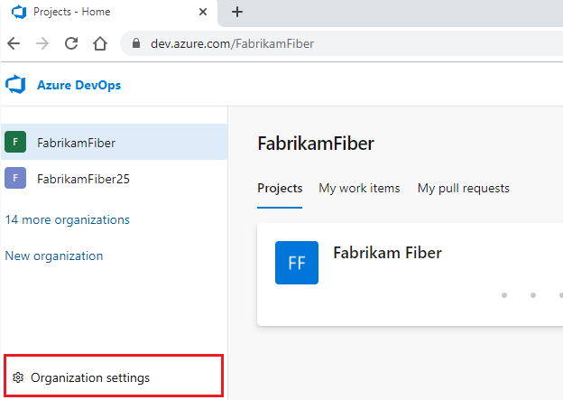

# Add external users to your organization

[!INCLUDE [version-eq-azure-devops](../../includes/version-eq-azure-devops.md)]

Learn how to invite external users to your organization. If you access Azure DevOps via Microsoft Entra ID, you must add the identities of those users to your Microsoft Entra ID. Doing so also grants the users more privileges. For more information, see [more organization-level resources](../projects/resources-granted-to-project-members.md).

## Prerequisites

| Category | Requirements |
|--------------|-------------|
|**Permissions** | Member of the [Project Collection Administrators group](../security/look-up-project-collection-administrators.md). Organization owners are automatically members of this group.|
| **Microsoft Entra tenant** |The Microsoft Entra tenant to which you want to invite external users allows adding new users, as per your Microsoft Entra guest policies. For more information, see [how to become eligible to invite external users on your Microsoft Entra tenant](/azure/active-directory/active-directory-b2b-delegate-invitations).|
| **Policies** |- **External guest access** turned **On** for the organization to which you want to invite external users.<br>- Team and Project Administrators can only invite external users if the user policy, **Allow team and project administrators to invite new users**, is **On**. For more information, see [Restrict invitations from Project and Team Administrators](../security/restrict-invitations.md).<br>- If the **Invite GitHub users** policy displays, you're recognized as a GitHub user and the GitHub invitation experience is available. For more information, see [Enable GitHub invitations](../../repos/get-started/sign-up-invite-teammates.md).|

> [!IMPORTANT]
> **Required:** Use a different email address or user principal name (UPN) for your personal and business accounts. This eliminates the challenge of disambiguating between your business and personal accounts when the email or UPN is the same.

## Invite external user

1. Sign in to your organization (```https://dev.azure.com/{yourorganization}```).

2. Select  **Organization settings**.

   

3. Select **Users**, and then select **Add users**.
   
   

4. Enter information based on the following guidance, and then select **Add**.

    - **Users**: Enter the email address for the user. You can add several email addresses by separating them with a semicolon (;). For Microsoft accounts (MSAs), the email addresses display in red.
    - **Access level**: You can add up to five users with *Basic* access. You're included as one of the five users. Otherwise, you can add an unlimited number of users with *Stakeholder* access. In public projects, both Stakeholder and Basic access levels grant full access to **Code**, **Work**, and **Build and Release**. But, Stakeholders only get partial access to **Test** and **Dashboards**. For more information, see [Default roles & permissions](../security/permissions-access.md).
    - **Add to projects**: Select each public project that you want to add the user to.  
    - **Azure DevOps Groups**: Leave this entry at Project Contributors, the default security group for people who contribute to your project. For more information, see [Default permissions and access assignments](../security/permissions-access.md).
    - **Send email invites**: Check this box to invite your new users via their email addresses.

5. Advise the external user to locate the email that they received from `AzureDevOps@microsoft.com` with the subject, **You have been invited to an Azure DevOps project** and select **Join now**. This final step adds the user to your organization. The invitation looks similar to the following image.

   :::image type="content" source="media/add-external-user/external-user-email-invitation.png" alt-text="Screenshot showing External user's invitation email.":::

>[!Note]
> If you need to resend the invitation email, go to **Users** > select the user > **Resend invite**.

The external user is added to the organization to which they were invited and has immediate access.

A guest user can add other guest users to the organization after being granted the Guest Inviter role in Microsoft Entra ID.

## Related content

* [Learn about Microsoft Entra B2B collaboration](/azure/active-directory/active-directory-b2b-what-is-azure-ad-b2b)
* [Migrate to group-based resource management](./assign-access-levels-by-group-membership.md)
* [Assign access levels to users by group membership](assign-access-levels-by-group-membership.md)
* [Restrict invitations to new users](../security/restrict-invitations.md)
