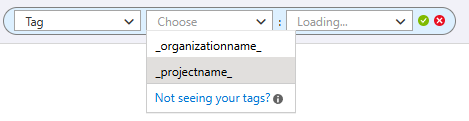

### Enterprise Live Migration tools added to the Azure DevOps Remote MCP Server

[Enterprise Live Migrations (ELM)](/azure/devops/repos/enterprise-live-migrations/overview) helps you migrate Azure DevOps repositories to GitHub Enterprise Cloud with data residency while minimizing disruption to your development teams.

We've added ELM support to the Azure DevOps Remote MCP Server, enabling agents to perform common migration tasks through the server.

For a list of the available tools and the required configuration, see the [Azure DevOps Remote MCP Server documentation](/azure/devops/mcp-server/remote-mcp-server?view=azure-devops#enterprise-live-migration-preview&preserve-view=true).

> [!NOTE]
> Enterprise Live Migrations (ELM) is currently in private preview.

### Project-level cost reporting for Copilot Code Reviews

We've added project tags to Copilot Code Review billing data, enabling Azure Cost Management reporting, budgets, and alerts on a per-project basis. This makes it easier to track Copilot Code Review costs by Azure DevOps project, improve cost attribution, and monitor usage across your organization.

> [!div class="mx-imgBorder"]
> 
