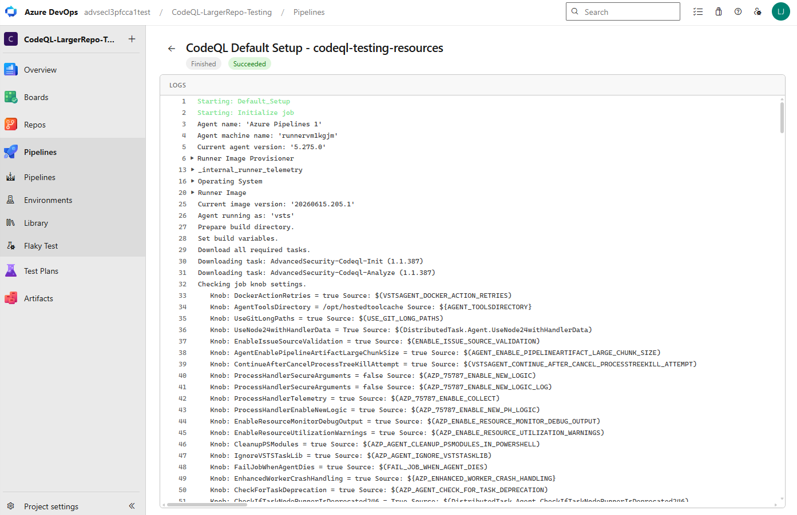
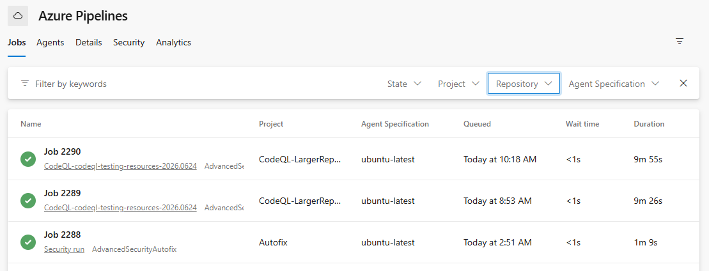
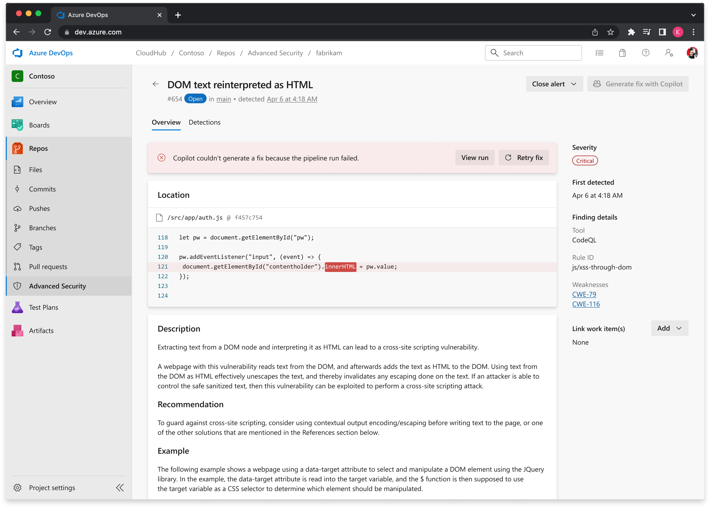

### CodeQL default setup is now generally available

CodeQL default setup is now generally available. Default setup is the fastest way to turn on CodeQL code scanning, it configures and runs CodeQL for your repository automatically, with no pipeline YAML to author or maintain. Enable it from your repository's **Settings** and Advanced Security handles the rest.

This release also brings improvements that make default setup runs easier to monitor and find:

- **Enhanced log viewer for default setup runs** — a focused, easy-to-read log view so you can quickly confirm a scan finished and succeeded, and dig into the details when you need to.

> [!div class="mx-imgBorder"]
> 

- **Clearer run naming** — an updated naming convention makes default setup runs easy to identify at a glance in your agent pool job log view.
- **New state and repository filters in the agent pool job log view** — filter jobs by state and repository to quickly find out what happened to a job across your agent pool. These filters apply to all jobs in the view, not just default setup runs.

> [!div class="mx-imgBorder"]
> 

### CodeQL default setup now supports C/C++

CodeQL default setup now supports C/C++. When you enable default setup, C/C++ appears as a supported language in the additional details panel and is scanned as part of your configured default setup experience. For more information, see [set up code scanning](/azure/devops/repos/security/github-advanced-security-code-scanning).

### CodeQL default setup automatically queues an initial run on enablement

When you enable CodeQL default setup at the organization or project level, an initial run is now automatically queued so you don't have to wait for the scheduled weekly run to get your first results. For more information, see [set up code scanning](/azure/devops/repos/security/github-advanced-security-code-scanning).

### Enable Autofix at the organization, project, or repository level

You can now enable Copilot Autofix at the organization, project, or repository level. Previously, Autofix could only be configured per repository; with multi-scope enablement you can turn it on once at a broader scope and have it apply across your repositories. For more information, see [Copilot Autofix for code scanning](/azure/devops/repos/security/github-advanced-security-code-scanning-autofix).

### Clear failure state and retry for Autofix runs

When a Copilot Autofix run fails, the alert detail view now surfaces a prominent failure state so you can quickly see that a run didn't succeed and where to go to investigate, along with a clear option to re-try the run.

For more information on Copilot Autofix, see [Copilot Autofix for code scanning](/azure/devops/repos/security/github-advanced-security-code-scanning-autofix).

> [!div class="mx-imgBorder"]
> 