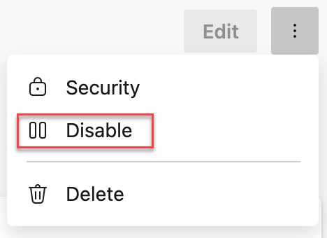
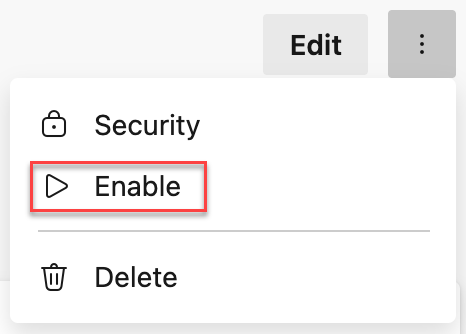

### Manual and automatic disablement of service connections

Service connections have standing access to external or remote services that are targeted or used in tasks in a pipeline job. When a pipeline is updated to trigger manually but in fact is never triggered, the access remains.

Service connections that are still referenced in pipelines but no longer used, can be disabled by the service connection admin e.g. the person who created the service connection or a Project Administrator. To disable a service connection click the 3 dots in the top right corner and select **Disable**.

> [!div class="mx-imgBorder"]
> 

Within Microsoft, we consider it a best practice to automatically disable service connections that have no usage. As part of the Secure Future Initiative **Secure by default** principle, we are starting to disable service connections that have not been used for 100 days. Service connections that are disabled are logged in the [Audit log](/azure/devops/organizations/audit/auditing-events#library-events). If you need to re-enable a service connection for usage after 100 days of inactivity, click the 3 dots in the top right corner and select **Enable**.

> [!div class="mx-imgBorder"]
> 

### The Azure DevOps issuer in workload identity federation service connections is deprecated

The Azure DevOps issuer in workload identity federation service connections is deprecated and is scheduled for retirement on July 1, 2027. The deprecated issuer uses the `https://vstoken.dev.azure.com` prefix in federated credentials.

New workload identity federation service connections use the Microsoft Entra issuer by default. Existing service connections that still use the Azure DevOps issuer continue to work until retirement, but you should update them to the Microsoft Entra issuer before July 1, 2027.

Service connections that need action appear at the top of the service connection list and show a warning in the service connection configuration UI. Select **Update** on the service connection to convert it to the Microsoft Entra issuer.

> [!IMPORTANT]
> This deprecation applies only to service connections in Azure public cloud that use single-tenant Microsoft Entra applications or managed identities. Service connections targeting non-public clouds, such as Azure Government, Azure China, or Azure Stack, and service connections that use multi-tenant applications (`signInAudience: AzureADMultipleOrgs`) are excluded.

For more information, see the [Retirement of Azure DevOps issuer in workload identity federation service connections](https://devblogs.microsoft.com/devops/retirement-of-azure-devops-issuer-in-workload-identity-federation-service-connections/) announcement and [Convert service connections from the Azure DevOps issuer to the Microsoft Entra issuer](/azure/devops/pipelines/release/convert-service-connections) documentation.
